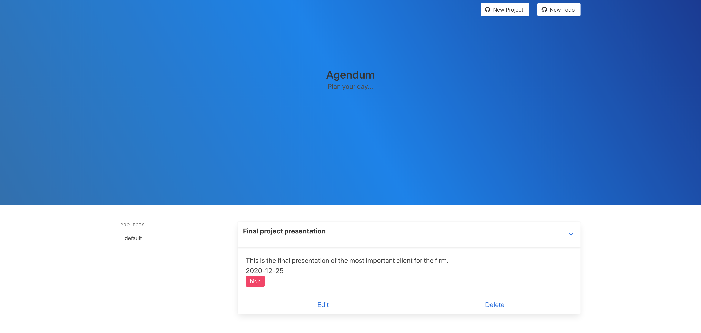

# TODO LIST

> The purpose of this project is to build a todo list app in order to showcase our mastery over object oriented design in javascript. 

## :hammer: Built With

- HTML5
- Javascript ES6
- Webpack
- Bulma

## Live Demo

[Todo App](https://flamboyant-brahmagupta-de97f9.netlify.app/)

## Getting Started

To get a local copy up and running follow these simple steps.

### Prerequisites
  
  You need to have git installed on your local system.
  You can clone this project with the command `$ git clone https://www.github.com/mariobarrioss/todo-list.git`.
  For this project you also require NPM installed on your machine.
  
### Setup
  
  No Further setup is required beyond cloning the repo on your local machine.
  
### Install
  
  To install the dependencies for the application run the following commands in your terminal
  
  `$ npm install`
  
### Usage
  
  To build the appplication the following command needs to be run in the terminal
  
  `$ npm run build`
  
### Run tests
  
 Test suite for:
 - localStorage module
 - Project module
 - Todo module

To run the tests type the following command in the terminal

`$ npm test`
  
### Deployment
  
  This section will be updated later.

## Authors

👤 **Rohan Sundar**

- GitHub: [@rsundar](https://github.com/rsundar)

👤 **Mario Barioss**

- GitHub: [@mariobarrioss](https://github.com/mariobarrioss)
- Twitter: [@mario_barrioss](https://twitter.com/@mario_barrioss)
- LinkedIn: [mariobarrioss](https://www.linkedin.com/in/mariobarrioss)

## 🤝 Contributing

Contributions, issues, and feature requests are welcome!

Feel free to check the [issues page](issues/).

## Show your support

Give a ⭐️ if you like this project!

## Acknowledgments

  A huge thanks to the webpack team for making available modern tooling for javascript.

## 📝 License

This project is [MIT](https://github.com/mariobarrioss/todo-list/blob/feature-branch/LICENSE) licensed.
